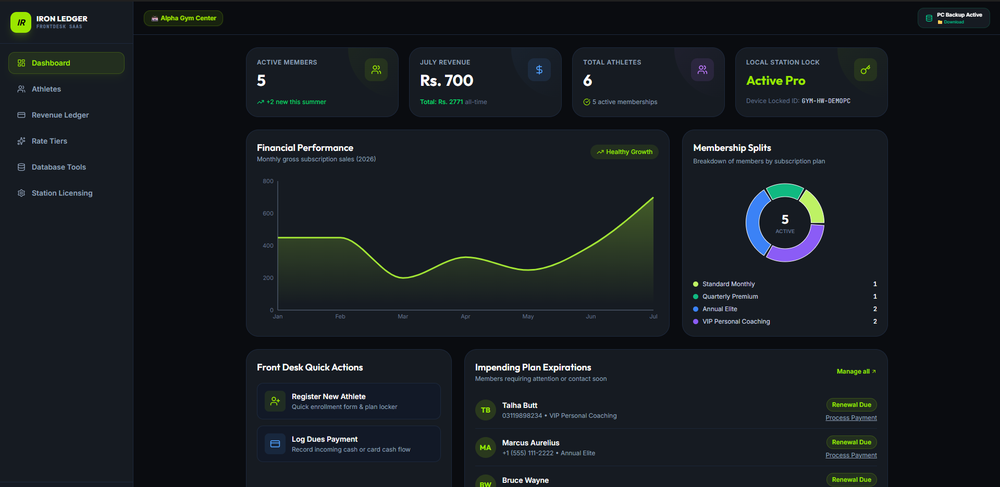

# Gym Management System & Desktop Station

A high-performance, desktop-ready Gym Management Application built with **React**, **TypeScript**, **Tailwind CSS**, **Lucide Icons**, and optimized for **Tauri** desktop app distribution. 

Designed for fitness centers, martial arts academies, and local gyms to manage memberships, check-ins, product sales (POS), expenses, monthly attendance reports, and software licensing nodes with offline support.

---

## 🌟 Key Features

### 🏋️ 1. Member Management
- **Full Lifecycle Control**: Add, renew, edit, freeze, or archive gym members.
- **Membership Tier Plans**: Support for Monthly, Quarterly, Bi-Annual, Annual, VIP, and Daily/Trainer passes.
- **Member Profiles & Photos**: Profile photos, emergency contacts, medical notes, membership start/end dates, and status indicators (**Active**, **Expiring Soon**, **Expired**, **Suspended**).
- **History Logs**: Instant access to member-specific check-in histories and billing/payment logs.

### ⏱️ 2. Attendance & Monthly Tracking
- **Express Quick Check-In**: Instant check-in search by Member ID, Name, or barcode/QR lookup.
- **Real-time Occupancy**: Live active gym count and capacity indicator.
- **Monthly Attendance Analytics**:
  - Daily & monthly attendance breakdown tables.
  - Interactive calendar heatmap showing peak workout days and member visit patterns.
  - Peak hours analysis to optimize staff and equipment availability.

### 🛒 3. Point of Sale (POS) & Retail Store
- **Product Catalog**: Quick cart management for supplements, gym apparel, water, lockers, day passes, and personal training sessions.
- **Flexible Payments**: Support for Cash, Card, Mobile QR / UPI, and Direct Bank Transfers.
- **Discounts & Receipts**: Apply custom or percentage discounts, calculate taxes, and generate printable digital receipts.

### 💰 4. Expense Tracker & Financial P&L
- **Income & Expense Ledger**: Log operating expenses (rent, electricity, equipment maintenance, staff salaries).
- **Financial Analytics**: Net Profit/Loss overview, revenue vs expense trends, and category summaries.
- **Export Capabilities**: Generate CSV / PDF summary reports for accounting and tax filing.

### 🔒 5. 1-Year Hardware-Locked License Security System
- **Hardware ID (HWID) Binding**: Binds the installed software instance to the gym owner's specific PC Hardware ID (e.g. `HW-8492` or motherboard/MAC ID hash).
- **Cryptographic Key Security**: Prevents unauthorized key sharing across multiple PCs.
- **Master Developer / Creator Panel**:
  - Master Developer Passcode protection (`GYM-DEV-9988` or `ADMIN2026`).
  - SaaS founders can generate 1-year keys formatted as `GYM-1YR-[HW_SUFFIX]-[XXXX]-[XXXX]`.
  - Machine activation validates Hardware ID suffix match before unlocking full node features.

### ⚙️ 6. System Customization & Backup
- **Gym Branding**: Customize Gym Name, Address, Phone, Logo, Currency Symbol, and Tax Rates.
- **Local Persistence**: Data persists in browser storage / local database with export/import JSON backup options.

---

## 🛠️ Tech Stack & Prerequisites

- **Frontend**: React 18, TypeScript, Tailwind CSS, Lucide React Icons
- **Build Tool**: Vite
- **Desktop Runtime**: Tauri (Rust-based lightweight desktop framework)
- **Node.js**: v18.0 or higher recommended

---
## Developed by 
- **Abdullah Shahzad""
- Founder of **XpertsWP**

---

## 📄 License
This project is released under the **MIT License**.
